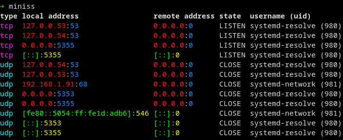

# miniss


**miniss** (_mini ss_) displays a list of open listening sockets. It is a minimal alternative to `ss` or `netstat`.

The goal of **miniss** is not to reinvent the wheel but rather to offer a static binary that can be deployed by pentester or CTF players on containers or hardened environnement where the classical `ss` or `netstat` binaries have been removed.



## Build


A pre-compiled static binary is provided only for `x86_64-linux-gnu`, see [releases](https://github.com/noraj/miniss/releases). Else read the [build](docs/build.md) instructions.

## Install

[](https://repology.org/project/miniss/versions)

See [install](docs/install.md) instructions.

## Usage

```
miniss v0.0.2

Usage:
  miniss [--tcp | --udp] [--ipv4 | --ipv6] [--debug --no-color]
  miniss -h | --help
  miniss --version

Options:
  -u --udp      Show UDP sockets.
  -t --tcp      Show TCP sockets.
  -4 --ipv4     Show IPv4 sockets.
  -6 --ipv6     Show IPv6 sockets.
  --debug       Display arguments.
  --no-color    Disable colorized output (NO_COLOR environment variable is respected too).
  -h --help     Show this screen.
  --version     Show version.

Examples:
  miniss --udp
  miniss -t6

Project:
  author (https://pwn.by/noraj / https://twitter.com/noraj_rawsec)
  source (https://github.com/noraj/miniss)
  documentation (https://noraj.github.io/miniss)
```

## Features

- Information displayed:
  - type of socket, local address, remote address, state, username, uid
- Type of sockets:
  - [x] TCP
  - [x] UDP
- IP version:
  - [x] IPv4
  - [x] IPv6

## Documentation

Documentation homepage: https://noraj.github.io/miniss/

[](https://noraj.github.io/miniss/lib-doc/Miniss.html)
[](https://noraj.github.io/miniss/build)
[](https://noraj.github.io/miniss/install)
[](https://noraj.github.io/miniss/CHANGELOG)
[](https://noraj.github.io/miniss/creating)
[](https://noraj.github.io/miniss/development)

## Author

- [noraj](https://pwn.by/noraj/) - creator and maintainer
